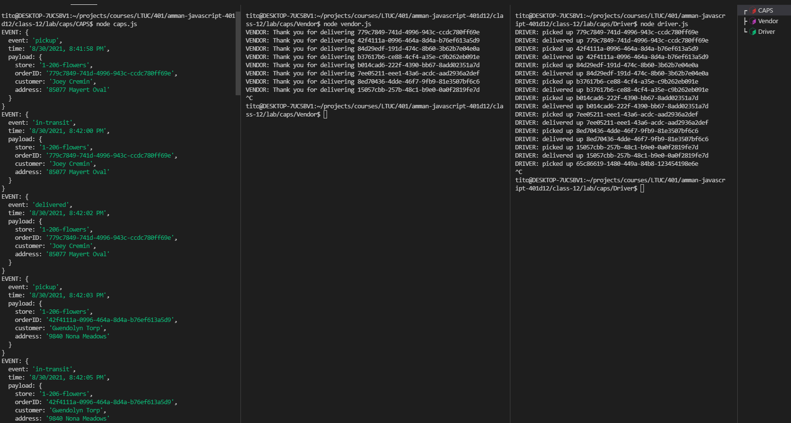
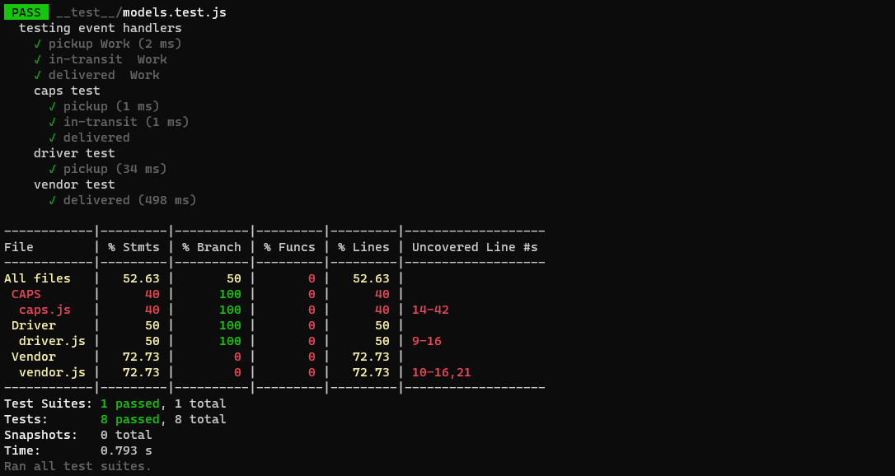
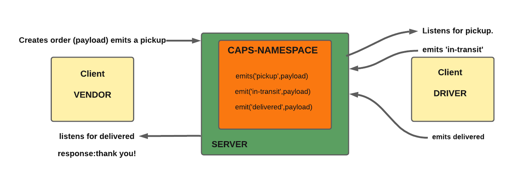

# caps

## LAB - 12

### Deployment Test

**Author: Tariq Abu-Laban**

- [tests report](https://github.com/Abu-laban/caps/actions).
- [pull request](https://github.com/Abu-laban/caps/pull/2).

**Setup**

`.env` **requirements**

- `PORT` = `3000`

- `STORE` = `1-206-flowers`

- `HOST` = `http://localhost:3000`

**Running the app**

- `npm start`

  - Returns Object

  

**Tests**

- Unit Tests: `npm run test`
- Lint Tests: `npm run lint`

**UML**

